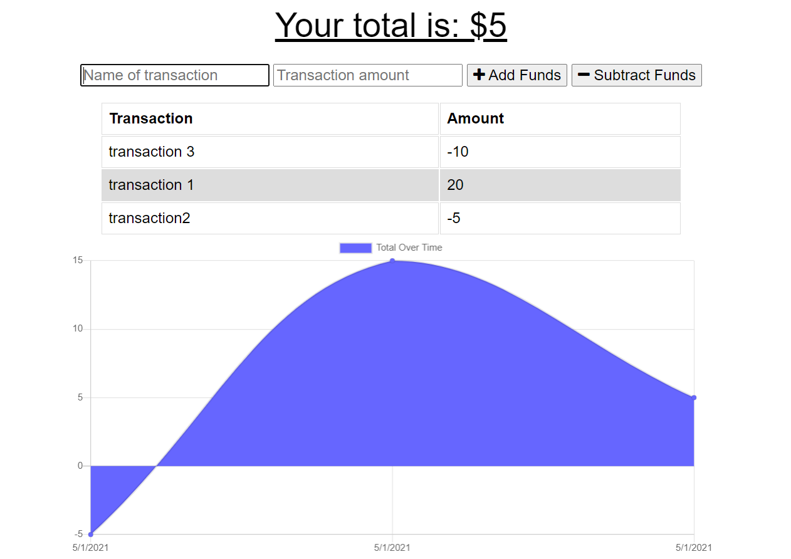

# Budget-tracker
' 

## Description
This is a Progressive Web Application (PWA) that allows the user to add expenses and deposits to their budget with or without an online connection. When entering transactions offline, data should populate the total when connected back online. 

## User Story

AS an avid traveller, I want  to be able to track my withdrawals and deposits with or without a data/internet connection so that my account balance is accurate when I am traveling.

## Screenshot

## Technologies

- HTML5
- CSS
- jQuery
- Express
- MongoDB
- Mongoose
- IndexedDB
- Bootstrap

## Usage
- Make sure you have MongoDB installed on your machine 
- Clone the repo
- Install dependencies with npm i
- Run npm start to run the server

## Demo

View the the app via heroku: https://git.heroku.com/budget-trackermarthagamez211.git 

